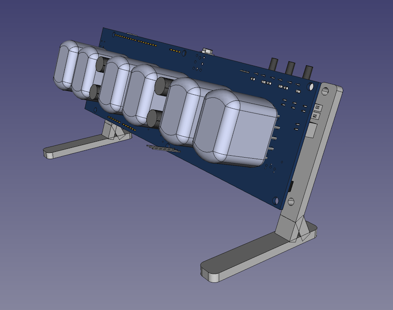
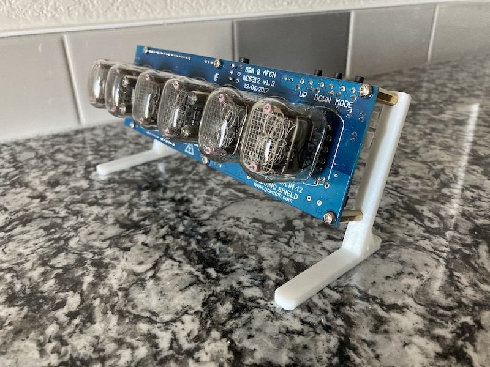

# nixie-clock-stands

## Description

This project comprises of two stands designed to be compatible with the GRA-AFCH NCS312 Arduino shield that, together, creates a 6-digit nixie tube clock utilizing IN-12 tubes as digit displays.  While the manufacturers of the Arduino shield do sell [their own clear stand](https://gra-afch.com/catalog/cases-for-nixie-tubes-clocks/acrylic-stand-for-in-12-shield-nixie-tubes-clocks/) for the reasonable price of $14.95, the cheapest shipping option offered by that store is more than the cost of the stand itself.

Inspired by [a creation I found on Thingiverse](https://www.thingiverse.com/thing:2232491) by a user with the name of [TimeWaster](https://www.thingiverse.com/TimeWaster) (who built their stands around the NCT412 Arduino shield), I created stands of my own design to be used with the NCS-312 shield instead.

## Cura Print Settings

**Creality Ender 3 V2**
- 0.4mm brass extruder nozzle
- 0.2mm layer height
- 20% infill
- No supports
- No extra adhesion

Note that two files-- a total of 4 parts-- will need to be printed:
1. [standoff-washers.stl](stl_files/standoff-washers.stl)
2. [stands-flat.stl](stl_files/stands-flat.stl)

The screws I purchased from Home Depot to use with these stands were identical in length, and were thus too long for the shorter brass standoff lug on the left side of the shield.  In order to solve this, I removed the short standoff lugs that secure the Arduino board to the shield, and replaced them with the first item on that list.  This way the Arduino was still held securely against the shield and I could make use of the longer screws I'd purchased.

The second file is a print-friendly STL of the stands.  Not that there _is_ a specific left and a specific right stand, due to the alignment of screw passthroughs in the NCS312 shield board.

For more information, check out my blog post here:

- [https://github.com/ckuzma/blog/blob/master/posts/2021/2021-02-16-nixie-stands.md](https://github.com/ckuzma/blog/blob/master/posts/2021/2021-02-16-nixie-stands.md)